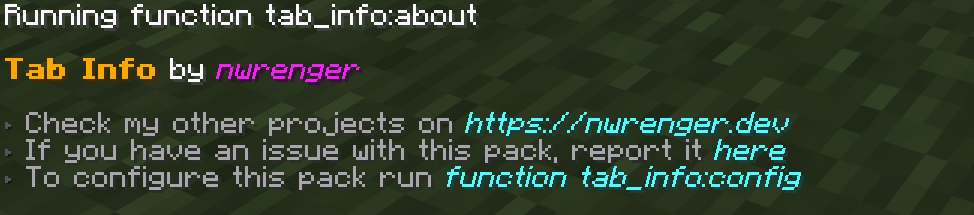
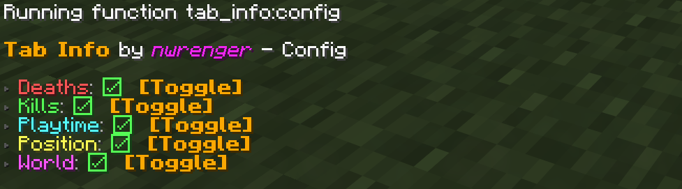

# Tab Info

[](https://modrinth.com/datapack/tab-info)
[](https://modrinth.com/datapack/tab-info)
[](https://modrinth.com/datapack/tab-info)

Shows useful player stats like **deaths**, **kills**, **playtime**, **position**, and **current dimension** to **everyone** through a compact, configurable rotating readout in the **player list**.

> Rotates every 2 seconds, works in multiplayer and singleplayer, and is fully server-side, so players do not need to install anything. Perfect for PvP servers, local worlds with friends, and more.


## Installation

After adding the data pack/mod to your world or server, you should be able to open the about panel, which is fully controllable with the mouse:

```mcfunction
/function tab_info:about
```



## Configuration

Open the configuration panel by the following command:

```mcfunction
/function tab_info:config
```



From here, you can toggle each info entry on or off. If every entry is disabled, Tab Info is hidden from the player list.

## Uninstallation

To remove the vacant entry inside the player list after disabling/removing the data pack/mod, run the following command:

```mcfunction
/scoreboard objectives setdisplay list
```

## Contributing & Issues

I warmly welcome:

- Bug reports
- Feature requests
- Pull requests

Please open issues or PRs on [GitHub](https://github.com/nwrenger/tab-info/issues).

## License

This project is licensed under the **LGPLv3 License**. See [LICENSE](https://github.com/nwrenger/tab-info/blob/main/LICENSE) for details.
